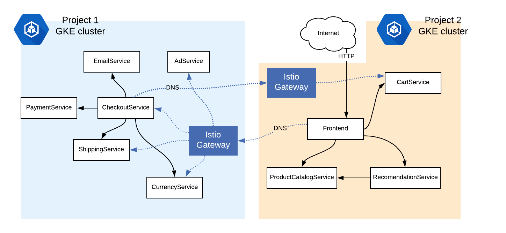

# Demo: Multicluster - Replicated Control Plane - Service Mesh

This example shows how to orchestrate an application with [Anthos Service Mesh](https://cloud.google.com/anthos/service-mesh) across two different
Google Kubernetes Engine clusters. To do this, we will unite two different Istio service meshes into
one logical, hybrid mesh.



This example is relevant if you run microservices on two different cloud platforms, or are
using a combination of on-prem and cloud Kubernetes. For demonstration purposes here, we'll use two GKE clusters in two different projects, and thus two
different [virtual networks](https://cloud.google.com/kubernetes-engine/docs/concepts/network-overview#inside-cluster).

## How it works

This demo uses ASM 1.6's [Multi Cluster](https://preliminary.istio.io/docs/concepts/multicluster-deployments/#multiple-control-plane-topology) feature. This is a specific mode of
multicluster Istio where two separate Kubernetes clusters run their own Istio control
plane, and orchestrate their own mesh. But each Istio control plane also runs a CoreDNS
server, which allows services in both clusters to refer to services in the other cluster,
as if they were part of their own mesh. A service in cluster 1 can call a
cluster 2 service.

The Kubernetes Service end points are discoverable across the clusters and know how to work together to resolve remote service names.

## Prerequisites

- Two GCP projects with billing and the Kubernetes API enabled
- `gcloud` CLI
- `kubectl`
- `helm` CLI

## Setup namespaces

On both the clusters create the namespaces.

```bash
kubectl create ns mesh
kubectl label namespace mesh istio-injection=enabled
```

## Link Two GKE Clusters

Join two clusters with Anthos Service Mesh pre-installed into a single mesh, by enabling cross-cluster load balancing between them. You can follow instructions outlined [here](https://cloud.google.com/service-mesh/docs/gke-install-multi-cluster) to achieve this.

## Deploy the Sample App

We will now deploy [Online Boutique, a sample application](https://github.com/GoogleCloudPlatform/microservices-demo), across our two GKE clusters.

For demonstration purposes, we've split the microservices into two halves. One group
will run on Cluster 1 (namespace `hipster`):

- emailservice
- checkoutservice
- paymentservice
- currencyservice
- shippingservice
- adservice

And another group will run on Cluster 2 (namespace
`mesh`):

- frontend
- productcatalogservice
- recommendationservice
- cartservice (configured to use a local store, not Redis)

Visually, we will deploy this topology:


The following script creates the following resources on both GKE clusters:

- Kubernetes Deployments for the services assigned to this cluster
- Kubernetes Services for the services that *are* running local to this cluster
- ServiceEntries for all the services *not* running on this cluster.
- ServiceEntries (type `MESH_EXTERNAL`) to access external Google APIs (necessary for
  Online Boutique to run)
- Istio VirtualServices / Gateway (for cluster 1 / the frontend only)

### Cluster 2

Deploy these resources across on cluster 2:

```bash
kubectl apply -f mcrcp/01-cluster2-hipster-deployments.yaml
kubectl apply -f mcrcp/02-cluster2-hipster-services.yaml
```

### Cluster 1

Deploy these resources across on cluster 1:

> Note: The manifests assume all traffic is routed to the application. If you use a domain edit the 05-cluster1-hipster-istio.yaml and change the frontend-gateway hosts to the domain/IP.

```bash
kubectl apply -f mcrcp/03-cluster1-hipster-deployments.yaml
kubectl apply -f mcrcp/04-cluster1-hipster-services.yaml
kubectl apply -f mcrcp/05-cluster1-hipster-istio.yaml
```

## Verify successful deployment

1. Get pods in cluster 1 (namespace `mesh`) to make sure all are `RUNNING` -

```bash
#output only, DO NOT COPY
NAME                               READY   STATUS    RESTARTS   AGE
adservice-84449b8756-4nhpm         2/2     Running   0          3m29s
checkoutservice-8dfb487c6-rwh9n    2/2     Running   0          3m30s
currencyservice-b9fcb4c98-98q7x    2/2     Running   0          3m29s
emailservice-57f9ddf9b9-hmpv7      2/2     Running   0          3m30s
paymentservice-84d7bf956-8f9br     2/2     Running   0          3m29s
shippingservice-78dc8784d4-7h4zx   2/2     Running   0          3m29s
```

2. Get pods in cluster 2 (namespace `hipster2`) to make sure all are `RUNNING` -

```bash
NAME                                     READY   STATUS    RESTARTS   AGE
cartservice-5b88d44bd-t6s6c              2/2     Running   0          2m31s
frontend-7958cf4f9-r2b9m                 2/2     Running   0          2m32s
productcatalogservice-c796f4c6d-qgfp8    2/2     Running   0          2m32s
recommendationservice-6788b77796-z4xq8   2/2     Running   0          2m31s
```

3. Get the Ingress Gateway `EXTERNAL_IP` in `cluster1`, where the web `frontend` is deployed:

```bash
kubectl config use-context gke_${PROJECT}_us-central1-b_dual-cluster2
kubectl get svc -n istio-system istio-ingressgateway
```

Navigate to that address in a browser.


4. View the service graph.

From the Anthos UI and navigate to the service mesh area to visulise the service topology.

Congrats! you just deployed Multicluster Istio across
two separate networks, then ran an application that spanned two Kubernetes
environments! All part of a single, two-headed Service Mesh. 🎉

## Clean up

Delete the 2 GKE clusters:

## Further reading

- To learn about Multicluster Istio and its different modes, [see the Istio docs](https://istio.io/docs/concepts/multicluster-deployments/)
- To learn how to configure and install the different modes, see the [Setup](https://istio.io/docs/setup/install/multicluster/) section in the Istio docs.
